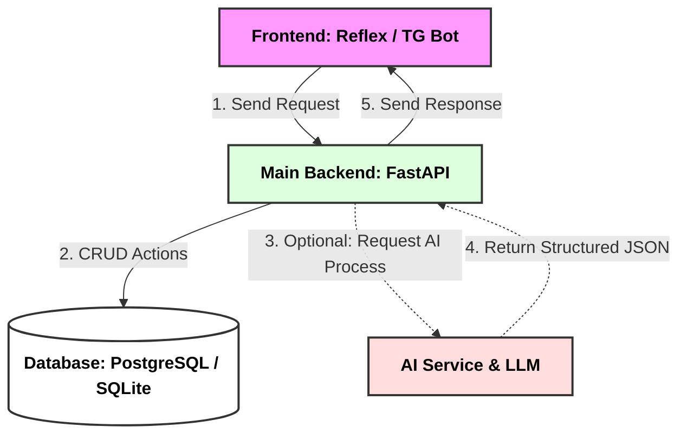

# todo-assistant

# TODO Application with AI & Telegram Integration

A modern task management (TODO) application featuring AI-powered command processing, a Telegram bot interface, and a microservices architecture.

## 🧱 Application Workflow Block Diagram

### Flowchart Breakdown

1. **Unified Entry Point:** Every user action from either the Reflex Web app or the Telegram Bot hits the FastAPI backend first.
2. **Conditional Routing:** 
   * **Clean Requests:** Standard actions (like manually completing a task) skip the AI infrastructure entirely and modify the database directly.
   * **AI-Assisted Requests:** Voice messages or natural language prompts are routed to the isolated AI Service. The service enriches the prompt with context from the database, runs the execution through the model, and returns a strict, structured JSON schema back to the main backend.
3. **State Consolidation:** FastAPI finalizes the database state for both paths and ensures that all user interfaces receive synced updates.

## 🛠 Component Breakdown

### 1. Main Backend (`Backend`)
*   **Technology Stack:** FastAPI, SQLAlchemy / Tortoise ORM, PostgreSQL / SQLite.
*   **Role:** Acts as the central hub of the application. It handles core business logic, user authentication, direct database management, and exposes the primary REST API for all frontend clients.

### 2. Web Frontend (`Frontend`)
*   **Technology Stack:** Reflex (Python-only web framework).
*   **Role:** The main web user interface. It communicates directly with the FastAPI backend to render the dashboard, task lists, and settings seamlessly.

### 3. Telegram Bot (`TG Bot`)
*   **Technology Stack:** aiogram / telebot.
*   **Role:** An alternative, mobile-friendly frontend client. It allows users to manage their TODO tasks on the go through interactive buttons, text messages, and voice notes.

### 4. AI Service (`AI Service`)
*   **Technology Stack:** Python, LLM APIs (or local models).
*   **Role:** A dedicated microservice isolated from the main business logic. It handles heavy or complex intelligent tasks:
    *   **Direct Database Access:** Queries the database independently to gather relevant task context or user logs needed for the prompt.
    *   **Prompt Processing:** Interprets natural language inputs (text) or audio messages (voice).
    *   **Structured Output:** Guarantees strict validation and formats the final AI response into a clean JSON object before returning it to the main backend.

---

## 🧠 AI Capabilities & System Workflow

1. **Flexible Input:** The user submits a command via text or voice (e.g., *"Remind me to call John tomorrow at 5 PM"*) through either the web interface or the Telegram bot.
2. **Context Enrichment:** The request is routed to the AI Service, which pulls any necessary background data directly from the DB.
3. **Structured Response:** The AI model parses the input and returns a validated JSON structure containing clean fields like `task_title`, `due_date`, and `priority`.
4. **State Synchronization:** FastAPI processes this structured response, saves the new task to the database, and updates both frontends.
